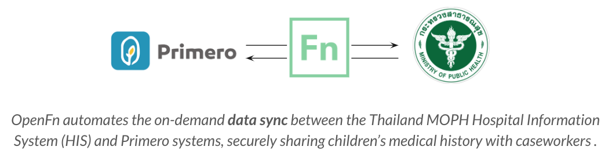
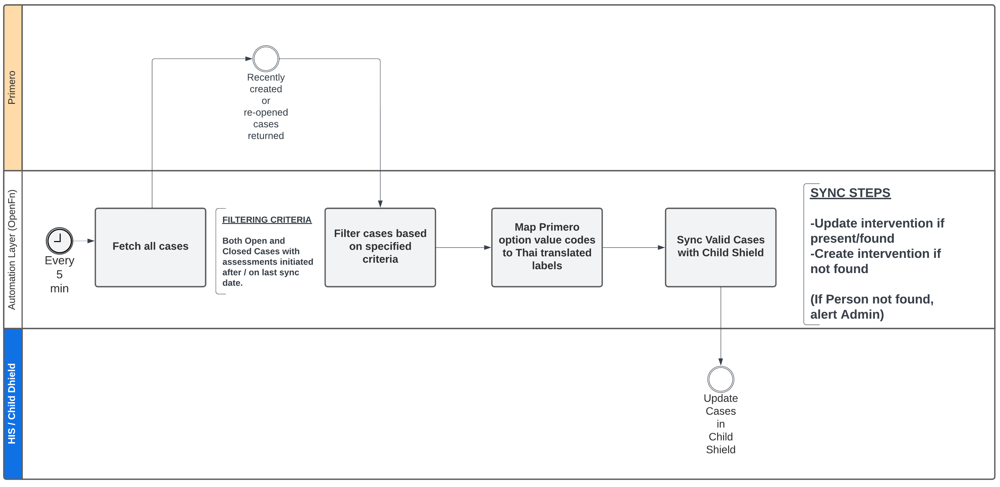
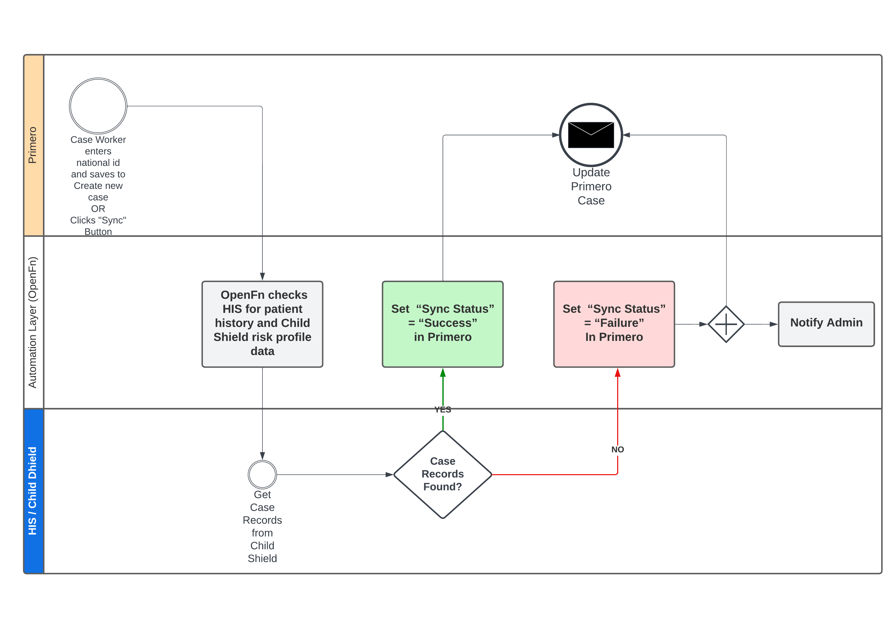

# UNICEF Thailand Primero Interoperability Phases 1 & 2
Repository to manage OpenFn jobs to integrate the UNICEF Primero and Thailand MoPH HIS and Child Shield systems for secure case referrals exchange.

### Note! Commits to 'master' branch will deploy automatically to live integration on OpenFn.org. 

## (1) Functional Requirements
The Interoperability Solution enables Primero case workers to consult historical patient information stored in the MOPH HIS system by fetching the information and sending it to Primero for display. The solution has also been extended to fetch risk model data and home service questionnaire data for better case understanding and management.

_**Workflow 1: Primero --> Child Shield**_
* Description: Syncing Primero cases to Child Shield for daily reporting.

An automated workflow has been configured to fetch primero cases and then either create or update the cases' intervention status and additional data in Child Shield, for both existing and previously closed cases without this information.

_**Workflow 2: HIS/Child Shield --> Primero**_
* Description: On-demand sync of HIS and Child Shield risk data to inform case plans.
 
When a case worker refreshes case data in Primero by using the Primero `Sync` button, any available forms (E.g. home service questionnaire, physical check assessment and risk data) for this person saved under the HIS or Child Shield systems are synced back to Primero.

## (2) System APIs
**APIs** implemented:
* Primero: [API v2](https://github.com/primeroIMS/primero/blob/development_v2/app/controllers/api/README.md)
The API uses `Basic authentication` for login and the `record_id` for upserting cases.

* MOPH systems: [API endpoint](https://cloud1.r8way.moph.go.th:3010/api)

Sample Data: 
1. When a record is found: [sample record](https://github.com/OpenFn/primero-thailand/blob/master/sampleData/state_HISpersonEndpoint14April.json)
2. When no records are found: [no record found](https://github.com/OpenFn/primero-thailand/blob/master/sampleData/state_HISpersonEndpointNotFound.json)

**OpenFn language-packages** (API adaptors) implemented: 
* [language-primero](https://github.com/OpenFn/language-primero)
* [language-http](https://github.com/OpenFn/language-http)

## (3) Data & Workflows
The business process flow diagram can be found [here](https://lucid.app/lucidchart/invitations/accept/inv_9f5bf24a-7c45-40b0-8718-42913469fa4b). The technical workflow diagram describing the integration logic can be found [here](https://lucid.app/lucidchart/fa23aa85-eee5-4172-b735-1b25cac8fbf5/edit?page=d.QBHCVmT4rm#).

_**Workflow 1: Primero --> MOHS API**_

The various integration jobs for this workflow are listed below, and illustrated in Figure 1 below.
1. `Get Primero Cases from HIS` fetches patient information from HIS based on `national_id` received in Primero sync notification.
2. `Get Translations from Primero` fetches field translations in Primero and posts them to the OpenFn Inbox
3. `Map data & sync to ChildShield` maps translated case data & syncs with Child Shield by either creating or updating intervention.

_Figure 1 - Workflow 1: Primero --> MOHS API_

_**Workflow 2: MOPH API --> Primero**_

The various integration jobs for this workflow are listed below, and illustrated in Figure 2 below.
1. `Get Patient Data from HIS` fetches patient information from HIS based on `national_id` received in Primero sync notification.
2. `Sync Data to Cases in Primero` sends the fetched HIS patient information to be displayed in Primero along with information to re-enable the Sync button.
3. `Upsert Failed Cases with Failed Sync Status` re-enables the Sync button in Primero without updating the case, in a situation where no matching patient is found in HIS. If any other error occured during the HIS sync, it will send fail status to re-enable the sync button with a `Sync failed` message.
4. `Send Primero Failure Status` re-enables the Sync button in Primero and updates the case, in a situation where a matching patient record was found in HIS but the sync failed.

_Figure 2 - Workflow 2: MOPH API --> Primero_

## (4) Flow Triggers
### Trigger Type: Event

For both flows, HIS <> Primero sync is launched when OpenFn receives a sync request notification from Primero.

### Integration Assumptions 
1. This integration was configured according to the mapping specifications finalized in January 2023. 
2. Every case will have a `National Id` that will be used to search for patient records in the HIS. 
3. The "sync" transaction will be initiated (1) automatically after _create_ of new cases, and (2) whenever a user clicks the `Sync` button in Primero. 

## (5) Data Element Mappings & Transformations
1. For Flow 1, [See this table](https://docs.google.com/spreadsheets/d/1f1fT3qmM4mKT98AaJ0ArlgONQRC-W9ghoa-j4BswwbM/edit?usp=sharing) for the integration mapping specifications. 
2. For Flow 2, [See this table](https://docs.google.com/spreadsheets/d/1f1fT3qmM4mKT98AaJ0ArlgONQRC-W9ghoa-j4BswwbM/edit#gid=1877091315) for the integration mapping specifications. 

The Forms that are updated in Flow 2 are:
* Child’s Quality of Life Questionnaire (CQ1)
* Child’s Quality of Life Questionnaire (CQ2 - AUQUEI1)
* Caregiver Survey form - PSu1 and PSu2 file
* Parent-Child Conflict Tactics Scale (CC-CTSPC-R)
* Risk Model

**Note**
1. If data synced from HIS is edited in Primero, it will be overwritten with the original value (or blank if there was no value in HIS) at the next sync.
2. `Physical examination` subforms are uniquely identified by `intervention ID + patient cid`.
3. `Unexpected pregnancy` subforms are uniquely identified by `date` and position of subform in list of pregnancy subforms.

## (6) Change Management
System administrators are responsible for identifying if changes may impact the OpenFn integration. 
1. If login credentials are changed for either system, the relevant **Credential** must be updated in OpenFn.org. 
2. If system changes are made to any of the **fields** referenced in the [field mappings](https://docs.google.com/spreadsheets/d/1f1fT3qmM4mKT98AaJ0ArlgONQRC-W9ghoa-j4BswwbM/edit?usp=sharing), the OpenFn jobs should be reviewed and tested to confirm no impact on the integration. 
3. If the list of available  **Forms** in either system changes, then the mapping should be reviewed in the [mapping document](https://docs.google.com/spreadsheets/d/1f1fT3qmM4mKT98AaJ0ArlgONQRC-W9ghoa-j4BswwbM/edit?usp=sharing) to confirm no updates are required in the OpenFn jobs.

## (7) Administration
### Provisioning, Hosting, & Maintenance
This integration is hosted on [OpenFn.org](https://openfn.org/projects) with Primero SaaS. OpenFn will provide ongoing maintenance support. 

### Error handling
The sync can have 3 statutes in Primero:
1. **Synced**: the data transfer was successful and HIS data is displayed in Primero
2. **Not found**: the `national ID` was not found in HIS, no data is added to Primero
3. **Failed**: an error occured during the process, no data is added to Primero

### Support 
Primero system administrators will be responsible for ongoing integration monitoring and management.  

Primero System Administrators: Mohan Masarangi Magar <mmmagar@unicef.org> and Tippawan Yaiya <tyaiya@unicef.org>  
MOPH System Administrators: Kumpha Brohmsena <king.nkp@gmail.com>, Watcharawan Teerawat <pinklotus1818@hotmail.com>, Choorug Lao-Akra <choorug@yahoo.co.uk>

Contact support@openfn.org with any questions or troubleshooting support. 

### Training Materials
1. [Open Function - Thailand Primero IO Flow 1 Training for Administrators (English/Thai) slides](https://docs.google.com/presentation/d/1-_TdK61T_BDaWtwv3EWnFvfka6kc1mgK/edit#slide=id.p1)
2. [Open Function - Thailand Primero IO Training for Administrators Video](https://drive.google.com/file/d/1ESGnWMC77IbWog9rRKwTw4qalu0kwiCq/view?usp=sharing)
3. [Primero End User Training - English](https://docs.google.com/presentation/d/1Y10hv8PtoDa766qRMbHbzOHPABRYbp4N8xdgecmWiHs/edit#slide=id.ga81cdd0b96_0_755)
4. [Open Function - Thailand Primero IO Flow 2 Training for Administrators (English)](https://docs.google.com/presentation/d/1yoMI6dGGsrJlHn4b25EnTQVXSaAvLG65iM1hUUs3kA4/edit#slide=id.g8c9d2ded25_0_193)
5. [OpenFn Administation - End user Training (with Thai translation)](https://docs.google.com/presentation/d/1gdhLQdhIqzr1ZdrrljxsSFUyVqaL_N9d/edit)

## Support Checklist
- [x] OpenFn Admin users & access levels confirmed 
- [x] OpenFn Admin training
- [x] Support POCs identified for each connected system
