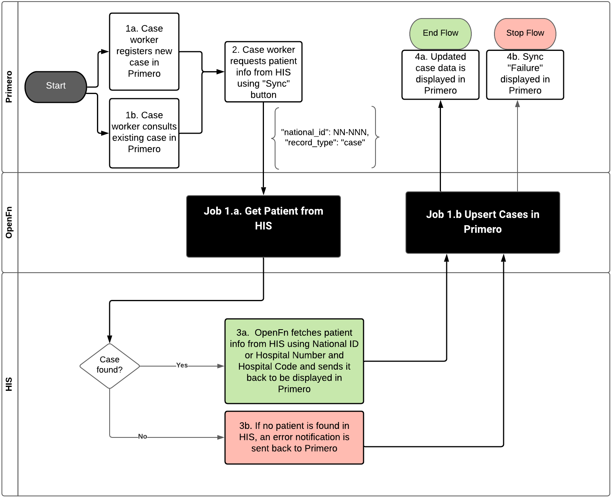

# UNICEF Thailand Primero Interoperability
Repository to manage OpenFn jobs to integrate the UNICEF Primero and Thailand MoPH HIS and Child Shield systems for secure case referrals exchange.
## See the full documentation site @ [https://openfn.github.io/primero-thailand/](https://openfn.github.io/primero-thailand/)

### Note! Commits to 'master' branch will deploy automatically to live integration on OpenFn.org. 

## (1) Functional Requirements
The Interoperability Solution enables Primero case workers to consult historical patient information stored in the MOPH HIS system by fetching the information and sending it to Primero for display.

_**Flow 1: MOPH referrals --> Primero**_
* Key User Story: Requesting MOPH case information from HIS to display it in Primero. When a case worker creates a new case or consults an existing case in Primero, they can request HIS information to be fetched and displayed in Primero by using the Primero Sync button.

## (2) System APIs
**APIs** implemented:
* Primero: [API v2](https://github.com/primeroIMS/primero/blob/development_v2/app/controllers/api/README.md)
The API uses `Basic authentication` for login and the `record_id` for upserting cases.

* MOPH systems: [API endpoint](https://cloud1.r8way.moph.go.th:3010/api)
Login: curl --request POST 'https://cloud1.r8way.moph.go.th:3010/api/Users/login' --data-raw '{"email":"email", "password":"password"}'
Get patient: curl --location --request GET 'https://cloud1.r8way.moph.go.th:3010/api/people/findOne?access_token=xxx&filter={%22where%22:{%22cid%22:%22111%22}, %20%22include%22:%20%22interventions%22}'
Behavior: 
1. [sample record](https://github.com/OpenFn/primero-thailand/blob/master/sampleData/state_HISpersonEndpoint14April.json)
2. [no record found](https://github.com/OpenFn/primero-thailand/blob/master/sampleData/state_HISpersonEndpointNotFound.json)

**OpenFn language-packages** (API adaptors) implemented: 
* [language-primero](https://github.com/OpenFn/language-primero)
* [language-http](https://github.com/OpenFn/language-http)

## (3) Data Flows
The data flow diagram can be found [here](https://lucid.app/lucidchart/invitations/accept/inv_9f5bf24a-7c45-40b0-8718-42913469fa4b). The diagram describing the integration logic can be found [here](https://lucid.app/lucidchart/fa23aa85-eee5-4172-b735-1b25cac8fbf5/edit?page=d.QBHCVmT4rm#).

_**Flow 1: MOPH referrals --> Primero**_
1. `1. Get Patient Data from HIS` fetches patient information from HIS based on `national_id` received in Primero sync notification.
2. `2. Update Cases in Primero` send fetched HIS patient information to be displayed in Primero along with information to re-enable the Sync button.
3. `3. Upsert Failed Cases` In case no matching patient is found in HIS, this job only re-enables the Sync button in Primero without updating the case. If any other error occured during the HIS sycn, it will send fail status to re-enable the sync button with a `Sync failed` message.

_**Note:**_ Integration with the Child Shield System is TBD and will be separately designed and implemented in the second phase of the Interoperability.

## (4) Flow Triggers
### Trigger Type: Event

HIS <> Primero sync is launched when OpenFn receives a sync request notification from Primero.

### Integration Assumptions 
[TO UPDATE]
1. This integration was configured according to the mapping specifications finalized in April 2021. HIS data migration is still in progress at this stage, so we expect there to be additional data points to map in the future. 
2. Every case will have a `National Id` that will be used to search for patient records in the HIS. 
3. The "sync" transaction will be initiated (1) automatically after _create_ of new cases, and (2) whenever a user clicks the `SYNC` button. 
<!--1. **Data Sharing**: ... 
2. **Unique Identifiers**: `national_id` for identifying patients in HIS, `record_id` for identifying Primero cases.
3. **Services**: ...
4. **Primero Case Owner Assignment**: ... -->

## (5) Data Element Mappings & Transformations
1. [See this table](https://docs.google.com/spreadsheets/d/1f1fT3qmM4mKT98AaJ0ArlgONQRC-W9ghoa-j4BswwbM/edit?usp=sharing) for the integration mapping specifications. 
2. If data synced from HIS is edited in Primero, it will be overwritten with the original value (or blank if there was no value in HIS) at the next sync.
3. `Physical examination` subforms are uniquely identified by `intervention ID + patient cid`.
4. `Unexpected pregnancy` subforms are uniquely identified by `date` and position of subform in list of pregnancy subforms.

## (6) Change Management
System administrators are responsible for identifying if changes may impact the OpenFn integration. 
1. If login credentials are changed for either system, the relevant **Credential** must be updated in OpenFn.org. 
2. If system changes are made to any of the **fields** referenced in the [field mappings](https://docs.google.com/spreadsheets/d/1f1fT3qmM4mKT98AaJ0ArlgONQRC-W9ghoa-j4BswwbM/edit?usp=sharing), the OpenFn jobs should be reviewed and tested to confirm no impact on the integration. 
3. If the list of available  **Forms** in either system changes, then the mapping should be reviewed in the [mapping document](https://docs.google.com/spreadsheets/d/1f1fT3qmM4mKT98AaJ0ArlgONQRC-W9ghoa-j4BswwbM/edit?usp=sharing) to confirm no updates are required in the OpenFn jobs.

## (7) Administration
### Provisioning, Hosting, & Maintenance
This integration is hosted on [OpenFn.org](https://openfn.org/projects) with Primero SaaS. OpenFn will provide ongoing maintenance support. 

### Error handling
The sync can have 3 statutes in Primero:
1. **Synced**: the data transfer was successful and HIS data is displayed in Primero
2. **Not found**: the `national ID` was not found in HIS, no data is added to Primero
3. **Failed**: an error occured during the process, no data is added to Primero

### Support 
Primero system administrators will be responsible for ongoing integration monitoring and management.  

Primero System Administrators: Mohan Masarangi Magar <mmmagar@unicef.org> and Tippawan Yaiya <tyaiya@unicef.org>  
MOPH System Administrators: Kumpha Brohmsena <king.nkp@gmail.com>, Watcharawan Teerawat <pinklotus1818@hotmail.com>, Choorug Lao-Akra <choorug@yahoo.co.uk>

Contact support@openfn.org with any questions or troubleshooting support. 

### Training Materials
1. [Open Function - Thailand Primero IO Training for Administrators (English/Thai) slides](https://docs.google.com/presentation/d/1-_TdK61T_BDaWtwv3EWnFvfka6kc1mgK/edit#slide=id.p1)
2. [Open Function - Thailand Primero IO Training for Administrators Video](https://drive.google.com/file/d/1ESGnWMC77IbWog9rRKwTw4qalu0kwiCq/view?usp=sharing)

## Support Checklist
- [x] OpenFn Admin users & access levels confirmed? 
- [x] OpenFn Admin training
- [x] Support POCs identified for each connected system? 
